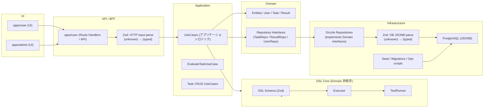

<!-- path: docs/architecture-diagram.md -->

# Architecture Diagram

czz は「DSL を組み立てて課題を解く」ゲームで、Clean Architecture の依存方向を守ることを最優先にしています。  
この図は **依存の向き** と **信頼境界（入力/DB の JSON を信頼しない）** を、初見でも追えるようにまとめたものです。

---

## 全体図（モノレポ / レイヤ）

---

## 読み方（3分で追う順）

1. 入口は **UI → apps/user の API(BFF)**。UI は API とだけ話す（UseCase の直接呼び出しはしない）。  
2. API は **unknown を受け取る前提**で、まず Zod で parse（型付け）してから UseCase に渡す。  
3. UseCase は「手続きのオーケストレーション担当」。  
   - Domain（Entity / Repository interface）を使う  
   - DSL Core を呼ぶ（命令列の実行とテストの評価）  
4. DB は **JSONB を置けるが、信用しない**。Repository 実装側で Zod で parse してからアプリへ返す。  
5. Infrastructure は Domain の interface を実装するだけで、Application/Domain の設計を逆流させない。

---

## レイヤ別の責務

### UI / API（apps）
- `apps/user`
  - UI（ゲーム画面）
  - API（BFF）：UI からの入力を受け、UseCase を呼び、レスポンスを返す
- `apps/admin`
  - 管理画面 UI（課題作成など）。原則として **API は持たず**、必要なら `apps/user` の API を利用

### Application（UseCase）
- ユースケース単位で手順を定義する（例：タスク評価、タスク作成/更新、結果保存）
- **外部の型・実装詳細に依存しない**
- 信頼境界を明確にする（入力/永続化データは parse してから扱う）

### Domain（Entity / Repository interface）
- 変わりにくいルールと構造（Entity）
- 永続化や外部 I/O は interface で抽象化（Repository interfaces）

### DSL Core（packages/dsl-core）
- DSL（命令列）の仕様と実行（Schema / Executor / TestRunner）
- **Domain から非依存**（教材として「小さな部品」を独立させる意図もある）
- 入力は unknown を前提に Zod で検証してから実行する

### Infrastructure（infra + Drizzle 実装）
- Drizzle ORM による Repository 実装（Domain interface を実装）
- PostgreSQL（JSONB）への永続化、seed/migrations、運用コマンド

---

## 信頼境界とセキュリティ要点

- **HTTP入力は信用しない**  
  `unknown → Zod.parse → typed` の順で UseCase に渡す（parse 失敗は 4xx）
- **DB の JSONB も信用しない**  
  DB から取り出した JSONB は `unknown` として扱い、Zod parse してから Application に戻す
- **dsl-core 実行は将来的に制約が必須（現状はメモ）**
  - 入力サイズ上限（命令数、データ件数、文字列長）
  - 実行ステップ上限（無限ループや過大計算の防止）
  - エラーメッセージの情報漏えい対策（内部詳細を出しすぎない）
  - ログの個人情報/秘匿情報マスキング

> これらの制約は **別 Issue で実装**する（設計図に「入れるべき場所」が分かるのが目的）。

---

## よくある迷子ポイント（置き場所の指針）

- 「DB の shape が変わるかも」→ Domain ではなく **Infrastructure + Zod schema** で吸収  
- 「画面の都合の if 文」→ UI か BFF に閉じる（UseCase を汚さない）  
- 「評価の手順や結果判定」→ UseCase（アプリケーションルール）  
- 「命令の意味（FILTER/SORT など）」→ dsl-core（実行エンジン）
